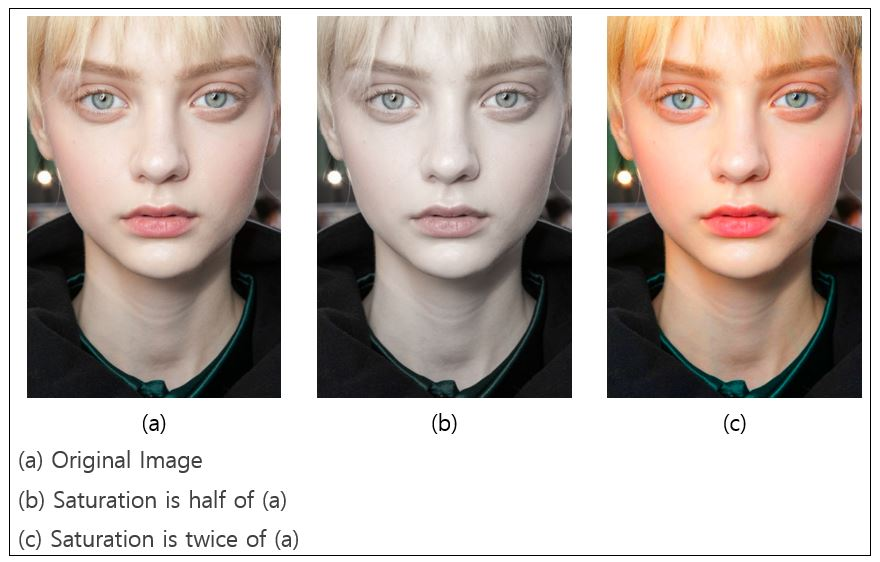
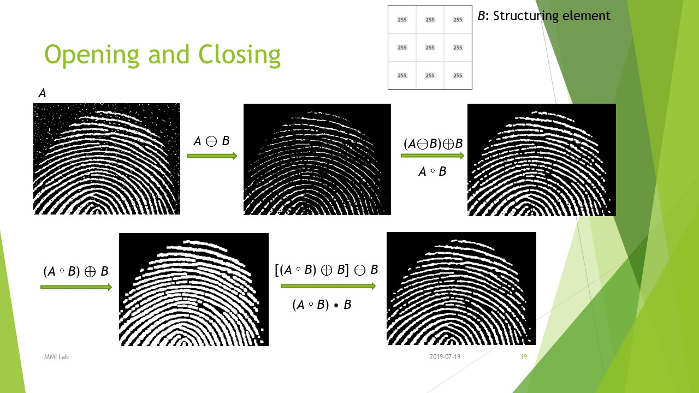
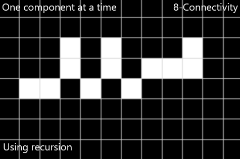
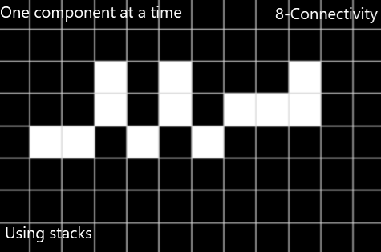

# DIP(Digital Image Processing) 

다양한 영상처리 알고리즘에 대한 코드와 발표자료입니다.  
Codes and PPT files for various image processing algorithms.  

이미지 입/출력을 하기 위해서는 opencv를 이용하였으며 나머지 알고리즘은 직접 작성하였습니다.  
I used opencv for input/output, and the remaining algorithms were coded by me.

# Summary for each project

Week1 : Filtering & Transformation  
Week2 : Morphological Processing & Image Thresholding  
Week3 : Connected-Component Labeling  
Week4 : Motion Estimation(Motion Vector) & Video Coding

# Examples
각 주차에 해당하는 폴더에서 자세한 ppt 발표자료를 받을 수 있습니다.  
You can see the more detailed examples and download PPT files in each foler.

아래 이미지들은 발표자료에서 일부를 가져와 보여준 것입니다.  
The images below are from my presentation.

### HSI Model로 Saturation 값 변경하기

### Morphology로 이미지 개선하기

### Recursion과 Stack

